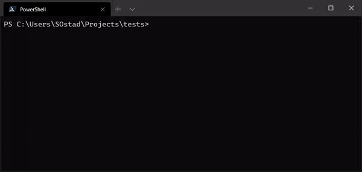

# node typescript starter

### Production ready starter for typescript node project

# Quick Start

`npx create-ts-starter PROJECT_NAME Vscode`

OR

`npm init ts-starter PROJECT_NAME VSCode`

### Notice:

- If you don't want to open the project folder in VSCode, You can ignore the 'VSCode' parameter.
- minimap is disabled by default.
- workbench sidebar is in right side of screen.

## Commands

- `npm start` to start the development environment
- `npm run test` to run tests
- `npm run test:watch` to run tests in watch mode
- `npm run format` to format with prettier
- `npm run lint` to lint with eslint
- `npm run gen-docs` to generate documentations website
- `npm run vulnerability-scan` to scan for vulnerabilities
- `npm run prod` to run in production
- `npm run compile` to compile to single executable file
- `npm run docker:build` to create docker image with data from `.env` file and version # from `package.json`
- `docker-compose up` to run in docker environment

## Functionalities

- pre-configured to publish or create npm module
- pre-configured to scan for vulnerabilities before publishing to registry
- pre-configured to git tag the commit at publish time
- pre-configured to generate changelog.md file after each publishes
- pre-configured to run tests with jest
- pre-configured to load environment variables from .env file
- pre-configured to load credentials from host operation system's credential manger
- pre-configured to run in a docker environment
- pre-configured to write logs in .log file in the logs directory with default log rotation of 7 days
- pre-configured to generate API documentation in docs folder of the root project directory
- pre-configured to compile the app to an executable single file
- pre-configured to connect Chrome DevTools in a development environment
- restart the process after modifying ts files
- dies at unhandled errors (this is a very good strategy for production - docker will take care of restart the program after exit)
- type-def for process.env variables
- pre-configured to [recommend vscode extensions](https://code.visualstudio.com/docs/editor/extension-gallery#_workspace-recommended-extensions)

## Powered By (Credit):

- [x] [typescript](https://github.com/Microsoft/TypeScript)
- [x] [fast-node-logger](https://github.com/saostad/fast-node-logger)
- [x] [jest](https://github.com/facebook/jest)
- [x] [eslint](https://github.com/eslint/eslint)
- [x] [pkg](https://www.npmjs.com/package/pkg)
- [x] [snyk](https://www.npmjs.com/package/snyk)
- [x] [keytar](https://www.npmjs.com/package/keytar)
- [x] [prettier](https://github.com/prettier/prettier)
- [x] [TypeDoc](https://github.com/TypeStrong/TypeDoc)
- [x] [auto-changelog](https://www.npmjs.com/package/auto-changelog)
- [x] [npm-run-all](https://github.com/mysticatea/npm-run-all)
- [x] [nodemon](https://github.com/remy/nodemon)
- [x] [colors](https://www.npmjs.com/package/colors)
- [x] [Docker](https://www.docker.com/)
- [x] [load-json-file](https://www.npmjs.com/package/load-json-file)

## TODO:

- [ ] add error handling [best practices](https://www.youtube.com/watch?v=62ZRPJkHOX0&list=WL&index=10&t=0s)
- [ ] [docker best practices](https://dev.to/nodepractices/docker-best-practices-with-node-js-4ln4)
- [ ] add entry for other builds (e.g. [esm](https://gist.github.com/sindresorhus/a39789f98801d908bbc7ff3ecc99d99c?s=03), browser, ...)
- [ ] fix failures when git is not installed on the host system.
- [ ] add templates to based on type of project that user wants to create, generate different projects ([esbuild](https://github.com/evanw/esbuild) for projects without decorators, tsc compiler, ...)
- [ ] add please wait... in initial of the process
